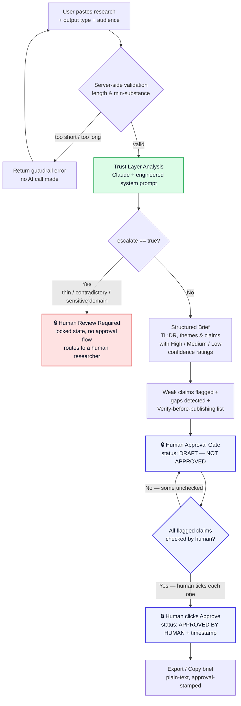

# InsightFlow — Workflow Diagram

The flow below shows how raw research becomes an approved, exportable brief. The
🔒 markers highlight the **human-control checkpoints** where a person — not the AI —
decides what happens next.

**Human-control checkpoints (🔒):**

1. **Human Review Required** — when the AI escalates, it refuses to produce an approvable brief and hands the input to a person.
2. **Human Approval Gate** — every brief starts as an unapproved draft; the AI cannot self-approve.
3. **Approve** — the brief becomes usable/exportable only after a human has verified each flagged claim and explicitly approved it.
